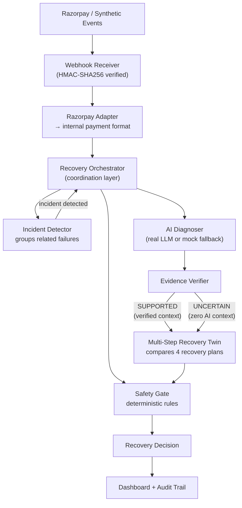

# AI Revenue Recovery

**Incident-aware payment recovery using AI diagnosis and a Multi-Step Recovery Twin.**

Razorpay AI Buildathon 2026 — Track 3: AI Revenue Recovery

---

## Problem

When a payment fails, most systems apply a single fixed retry rule. But correlated failures — like 7 UPI payments from the same bank failing within minutes — indicate a shared infrastructure issue that a single retry cannot solve. The right recovery depends on the root cause: waiting for a temporary bank outage, retrying after a window, suggesting an alternate payment method, or contacting the customer.

**AI Revenue Recovery** detects these correlated incidents, uses AI to diagnose the likely root cause, and then compares complete multi-step recovery sequences to find the safest, most effective plan.

---

## Core Novelty: Multi-Step Incident Recovery Twin

Instead of choosing a single recovery action, the system simulates **complete recovery sequences** and compares them on the same incident before selecting the best plan.

For example, the four candidate plans for a BANK\_X UPI incident:

| Plan | Sequence | Simulated Recovery |
|---|---|---|
| **PLAN\_D\_CONSERVATIVE** | Wait → Recheck → Retry → Alternate | 7/7 recovered |
| **PLAN\_A\_SAFE\_WAIT** | Wait → Recheck → Retry | 7/7 recovered |
| **PLAN\_B\_FAST\_RECOVERY** | Retry → Alternate → Contact | 4/7 recovered |
| **PLAN\_C\_CUSTOMER\_ALTERNATE** | Alternate → Link → Contact | 3/7 recovered |

Each plan is scored on recovery effectiveness, customer friction, and attempt efficiency. The plan with the highest composite score is selected. This is not a simple retry counter — it evaluates multi-step strategies with different ordering, different actions, and different trade-offs.

---

## How AI Is Used

AI acts as an **incident analyst**, not a recovery executor.

When a correlated incident is detected, the system calls a real LLM (via OpenRouter) to produce a structured diagnosis:

- **Likely root cause** — what is probably failing
- **Incident scope** — which bank, method, and error pattern
- **Confidence** — how certain the model is
- **Evidence** — supporting signals from the payment data

### Evidence-Gated AI Planning

AI diagnosis can only influence recovery planning when a deterministic **Evidence Verifier** marks it as **SUPPORTED**. If the diagnosis is **UNCERTAIN**, AI has zero influence on the recovery plan — the system falls back to purely deterministic rules.

**AI can advise; deterministic safety rules remain authoritative.**

---

## Architecture



**Frontend / Backend relationship:**

```
React Dashboard  →  Flask API  →  Python Authoritative Backend
```

The React dashboard visualizes backend data. All business logic — incident detection, AI diagnosis, Recovery Twin scoring, Safety Gate evaluation — runs in the Python backend. The frontend does not reproduce any calculations.

---

## Capabilities

- **Correlated incident detection** — groups related failures by bank, method, and error reason within a time window
- **Razorpay webhook ingestion** — receives `payment.failed`, `payment.captured`, `payment.authorized` events
- **HMAC-SHA256 signature verification** — validates webhook authenticity using `X-Razorpay-Signature`
- **Duplicate webhook protection** — idempotent processing via Razorpay event IDs
- **Late-success handling** — a later `payment.captured` stops recovery for that payment
- **Out-of-order event protection** — captured payments are never downgraded to failed
- **Real LLM diagnosis** — structured output via OpenRouter with JSON schema enforcement
- **Evidence verification** — deterministic check before AI context enters recovery planning
- **Multi-Step Recovery Twin** — compares 4 complete recovery sequences per incident
- **Bounded AI context influence** — AI bonus is capped and never overrides the Safety Gate
- **Safety Gate** — blocks duplicate recovery, max attempts, cooldown violations, and late-success conflicts
- **Audit trail** — every decision milestone is recorded with timestamps
- **Interactive dashboard** — progressive demo with investigation and real-time backend data

---

## Demo: BANK\_X UPI Incident

The dashboard includes a deterministic synthetic demo:

- **10 payments** from BANK\_X via UPI within a 5-minute window
- **7 failed** with `technical_error`
- **3 captured/successful**
- **70% failure rate**
- **₹17,500 simulated revenue at risk**

The demo progresses through each stage of the pipeline:

1. **Incident Detected** — correlated BANK\_X UPI failures identified
2. **LIVE AI Diagnosis** — root cause: temporary bank-side technical failure (SUPPORTED)
3. **Recovery Twin** — 4 plans compared, PLAN\_D\_CONSERVATIVE selected
4. **Safety Gate** — all actions approved (no duplicate, no cooldown, no max-attempts violation)
5. **Simulated Recovery** — 7/7 affected failed payments recovered

---

## Evaluation Results

Both policies were evaluated on the **same** synthetic payment dataset of 78 records (55 failed). All results are **simulated**.

| Metric | Baseline | Recovery Twin | Difference |
|---|---|---|---|
| Payments recovered | 17 | 22 | +5 |
| Recovery rate | 30.9% | 40.0% | +9.1% |
| Revenue recovered | ₹45,000 | ₹56,900 | +₹11,900 |
| Recovery attempts | 47 | 27 | −20 avoided |
| Customer-facing actions | 8 | 5 | −3 avoided |
| Unsafe actions blocked | 8 | 8 | — |
| Late-success stops | 8 | 8 | — |

> **SIMULATED / PROTOTYPE EVALUATION — NOT PRODUCTION RAZORPAY PERFORMANCE.**

The Multi-Step Recovery Twin recovered ₹11,900 more in simulated revenue while making 20 fewer recovery attempts and 3 fewer customer-facing actions than the baseline.

---

## Safety Design

Every recovery action passes through a deterministic **Safety Gate** before execution:

| Rule | Behavior |
|---|---|
| Already captured | Block recovery |
| Already recovered | Block duplicate |
| Maximum attempts reached | Block further recovery |
| Recovery cooldown active | Block premature retry |
| Customer contact limit exceeded | Block customer-facing action |
| Late success detected | Stop recovery immediately |

The Safety Gate is the final authority. AI diagnosis influences which plan is selected, but cannot bypass safety rules.

---

## Deployment

### Live

| Service | URL |
|---|---|
| **Dashboard** | https://razorpay-revenue-recovery-dashboard.onrender.com |
| **Backend Health** | https://razorpay-ai-revenue-recovery-l94i.onrender.com/health |

> Render free-tier services may need a short cold-start period on first visit.

### Render Backend — Web Service

| Setting | Value |
|---|---|
| Root directory | `/` (repository root) |
| Build command | `pip install -r requirements.txt` |
| Start command | `gunicorn backend.api:app --bind 0.0.0.0:$PORT` |
| Health endpoint | `/health` |

Required environment variables:

| Variable | Value |
|---|---|
| `AI_DIAGNOSER_API_KEY` | Your OpenRouter API key |
| `AI_DIAGNOSER_API_BASE` | `https://openrouter.ai/api/v1` |
| `AI_DIAGNOSER_MODEL` | `dots-studio/dots-3-note-preview:free` |
| `AI_DIAGNOSER_TIMEOUT` | `30` |

### Render Frontend — Static Site

| Setting | Value |
|---|---|
| Root directory | `dashboard` |
| Build command | `npm install && npm run build` |
| Publish directory | `dist` |
| Environment variable | `VITE_API_URL=<deployed backend URL>` |

---

## Tech Stack

| Layer | Technology |
|---|---|
| **Backend** | Python, Flask, Gunicorn |
| **AI** | OpenRouter-compatible LLM, structured JSON output, deterministic Evidence Verifier |
| **Frontend** | React, TypeScript, Vite, Tailwind CSS, Framer Motion |
| **Testing** | Python `unittest` |
| **Deployment** | Render Web Service (backend), Render Static Site (frontend) |

---

## Testing

```
Backend tests:   401 passed, 0 failed, 0 errors
TypeScript:      0 errors
Vite build:      successful
```

---

## Local Setup

### Backend

```bash
pip install -r requirements.txt
python3 backend/api.py
```

The backend starts on `http://127.0.0.1:5001` by default.

### Dashboard

```bash
cd dashboard
npm install
npm run dev
```

The Vite dev server proxies `/api/*` to the Flask backend automatically.

### Environment Variables

Set these in your shell or `.env` file (never commit secrets):

| Variable | Purpose |
|---|---|
| `AI_DIAGNOSER_API_KEY` | Enables real LLM diagnosis (omit for mock mode) |
| `AI_DIAGNOSER_API_BASE` | LLM API base URL |
| `AI_DIAGNOSER_MODEL` | Model identifier |
| `AI_DIAGNOSER_TIMEOUT` | Request timeout in seconds |
| `RAZORPAY_WEBHOOK_SECRET` | Webhook signature verification secret |

---

## Repository Structure

```
backend/
  api.py                    # Flask API server
  incident_detector.py      # Correlated incident detection
  ai_diagnoser.py           # Real LLM structured diagnosis
  recovery_orchestrator.py  # End-to-end pipeline coordination
  recovery_twin.py          # Multi-step plan comparison
  recovery_plan.py          # Plan definitions and simulation
  safety_gate.py            # Deterministic safety rules
  razorpay_adapter.py       # Razorpay → internal payment format
  razorpay_webhook.py       # Secure webhook receiver
  payment_simulator.py      # Synthetic payment generation
  baseline_policy.py        # Baseline comparison policy
  evaluator.py              # Baseline vs Twin evaluation

dashboard/
  src/App.tsx               # Main dashboard
  src/lib/api.ts            # Backend API client
  src/lib/simulation.ts     # UI timing helpers (no business logic)
  src/index.css             # Fintech dark theme
  vite.config.ts            # Vite + Tailwind + API proxy

tests/
  test_incident_detector.py
  test_ai_diagnoser.py
  test_orchestrator.py
  test_recovery_twin.py
  test_recovery_plan.py
  test_safety_gate.py
  test_razorpay.py
  test_api.py
  test_payment_simulator.py
  test_baseline_policy.py
  test_evaluator.py

data/sample_payments.csv
README.md
DEPLOYMENT.md
requirements.txt
```

---

## Limitations & Future Work

### Current limitations

- Recovery outcomes are **simulated**, not real financial transactions
- State is in-memory; no persistent database
- No real money movement — the Safety Gate ensures no actual payment actions execute
- Demo uses synthetic test payment data
- No production Razorpay API integration

### Future work

- Persistent database for payment history and decisions
- Production Razorpay webhook integration with live payment data
- Richer incident-specific recovery strategies
- Streaming architecture for real-time large-scale payment monitoring
- Customer notification and communication channels

---

## License

Internal project — Razorpay AI Buildathon 2026.
